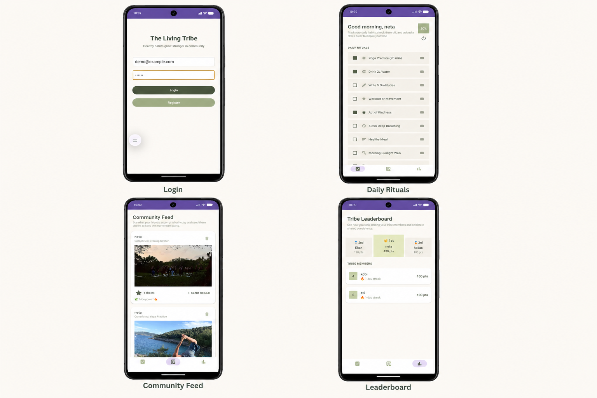

# The Living Tribe

The Living Tribe is a native Android community app that helps people build healthy habits together. Members can complete daily rituals, earn tribe points, share photo proof of their progress, encourage one another in a live community feed, and compete on a real-time leaderboard.

<p align="center">
  
</p>

<p align="center">
  <strong>Build healthy habits. Share progress. Grow together.</strong>
</p>

## Experience at a Glance

The app follows one connected member journey:

1. **Join the tribe** with secure email and password authentication.
2. **Complete daily rituals** and watch progress and tribe points increase.
3. **Share photo proof** of a completed activity with the community.
4. **Encourage other members** through cheers and quick positive comments.
5. **Climb the leaderboard** as consistency turns into tribe points.

## Main Features

### Authentication and member profiles

- Register with a full name, email address, and password.
- Sign in and sign out with Firebase Authentication.
- Store each member's name, points, and streak in Cloud Firestore.
- Start new members with 100 tribe points and a one-day streak.

### Daily rituals

The app includes ten daily wellness activities, such as yoga, drinking water, gratitude, movement, breathing, healthy eating, walking, reading, and stretching.

- Check off completed rituals.
- See the completion percentage update immediately.
- Earn 10 points for each checked ritual.
- Upload a photo as proof for any ritual.
- View the current point total and streak.

### Community feed

- Share uploaded proof photos as community posts.
- Display the newest posts first with live Firestore updates.
- Give or remove a cheer from a post.
- Send a predefined positive comment through a quick-cheer dialog.
- Show the three most recent comments on each post.
- Allow only the post owner to see the delete action in the UI.
- Delete both the Firestore post and its associated Supabase image when possible.

### Leaderboard

- Rank members by tribe points in descending order.
- Present the top three members on a podium.
- Display all remaining members in a scrollable list starting at rank four.
- Update the ranking in real time as Firestore data changes.

### Navigation and design

- Use a persistent bottom navigation bar for Rituals, Feed, and Leaderboard.
- Follow a calm, nature-inspired visual style with green and neutral colors.
- Use scrollable layouts and RecyclerView lists for different screen sizes.

## Screens

The interface uses a calm, nature-inspired palette and keeps the three core areas one tap away through persistent bottom navigation.

| Screen | Purpose |
| --- | --- |
| Login | Authenticates an existing member with email and password. |
| Register | Creates a Firebase account and a corresponding Firestore profile. |
| Daily Rituals | Tracks daily activities, progress, points, photo proof, and logout. |
| Community Feed | Shows proof posts and supports cheers, comments, and owner deletion. |
| Tribe Leaderboard | Displays the top three members and the rest of the live ranking. |

### Screen highlights

- **Login:** A focused entry point for existing members, with direct access to registration.
- **Daily Rituals:** Ten wellness activities, live completion percentage, photo-proof actions, points, and streak information.
- **Community Feed:** A real-time stream of member achievements with images, owner-only deletion, cheers, and supportive comments.
- **Leaderboard:** A dedicated top-three podium followed by a RecyclerView ranking for the rest of the tribe.

## Technology

| Area | Technology |
| --- | --- |
| Language | Kotlin, targeting Java 11 bytecode |
| UI | Android Views, XML layouts, Material Components |
| Authentication | Firebase Authentication |
| Database | Firebase Cloud Firestore |
| Image storage | Supabase Storage |
| Networking | OkHttp |
| Image loading | Picasso |
| Lists | AndroidX RecyclerView with custom adapters and view holders |
| Build | Gradle Kotlin DSL with a version catalog |
| Testing | JUnit, AndroidX Test, and Espresso |

The project currently compiles against Android API 36, targets API 34, and supports Android 8.0 (API 26) or newer.

## How the Data Flows

```text
Email and password
        |
        v
Firebase Authentication
        |
        +------> users collection in Cloud Firestore
        |              |
        |              +------> profile, points, streak, leaderboard
        |
Photo selected from the device
        |
        v
Supabase Storage ------> public image URL
                                |
                                v
                    posts collection in Firestore
                                |
                                v
                 live community feed and cheers
```

## Firestore Data Model

### `users/{userId}`

```text
fullName: String
email: String
points: Number
streak: Number
```

### `posts/{postId}`

```text
userId: String
userName: String
missionName: String
imageUrl: String
timestamp: Number
likesCount: Number
likedBy: List<String>
comments: List<String>
```

Older or newly created posts can omit the reaction fields because the Kotlin model supplies safe default values.

## Project Structure

```text
The-Living-Tribe/
|-- app/
|   |-- src/main/java/com/example/thelivingtribe/
|   |   |-- MainActivity.kt
|   |   |-- RegisterActivity.kt
|   |   |-- DailyMissionsActivity.kt
|   |   |-- FeedActivity.kt
|   |   |-- FeedAdapter.kt
|   |   |-- LeaderboardActivity.kt
|   |   |-- LeaderboardAdapter.kt
|   |   |-- Post.kt
|   |   `-- LeaderboardUser.kt
|   |-- src/main/res/
|   `-- google-services.json
|-- gradle/libs.versions.toml
|-- build.gradle.kts
`-- settings.gradle.kts
```

## Getting Started

### Prerequisites

- Android Studio with the Android SDK installed.
- JDK 17 or newer.
- An emulator or physical device running Android 8.0 or newer.
- A Firebase project with Email/Password Authentication and Cloud Firestore enabled.
- A Supabase project with a Storage bucket named `proofs`.

### Firebase configuration

Place the Firebase Android configuration file at:

```text
app/google-services.json
```

The Firebase project must be configured for the application ID `com.example.thelivingtribe`. Firestore security rules should restrict profile and post mutations to authorized users before the app is used outside a demonstration environment.

### Supabase configuration

Add the following values to the root `local.properties` file:

```properties
SUPABASE_URL=https://YOUR_PROJECT.supabase.co
SUPABASE_ANON_KEY=YOUR_SUPABASE_ANON_KEY
```

`local.properties` is intentionally ignored by Git and must not be committed. The `proofs` bucket and its access policies must support the upload, public-read, and delete operations used by the app.

### Run the app

1. Clone the repository.
2. Open it in Android Studio.
3. Add the required Firebase and Supabase configuration.
4. Sync the Gradle project.
5. Select the `app` run configuration and a compatible device.
6. Run the application.

From the command line:

```bash
./gradlew assembleDebug
```

On Windows:

```powershell
.\gradlew.bat assembleDebug
```

## Current Limitations

- Ritual checkbox state is not persisted and resets when the screen is recreated.
- Rituals are not yet separated or reset automatically by calendar day.
- The streak value is displayed but is not automatically recalculated.
- A proof image can be uploaded independently of checking a ritual.
- Selected images are currently read fully into memory before upload, so very large files may cause high memory usage.
- Empty, loading, and dedicated offline states are still minimal.
- The app does not automatically skip the login screen when a Firebase session already exists.
- Automated tests currently cover only the starter unit and instrumentation checks.

## Future Improvements

- Persist daily ritual completion and reset it according to the user's local date.
- Calculate streaks from verified daily activity.
- Compress and stream images before uploading them.
- Add profile editing and member avatars.
- Add loading, empty, retry, and offline UI states.
- Add password reset and email verification.
- Improve navigation and session restoration.
- Add unit, integration, and UI tests for the main user journeys.
- Strengthen Firebase and Supabase authorization rules for production use.

## Privacy and Security Notes

The repository must never contain private service credentials. A Supabase anon key is intended for client use only when it is protected by appropriate Row Level Security and Storage policies. Firebase and Supabase rules are part of the application's security boundary and should be reviewed before publishing real user data.

## License

This project was created as an educational Android application. No separate open-source license has been added.
